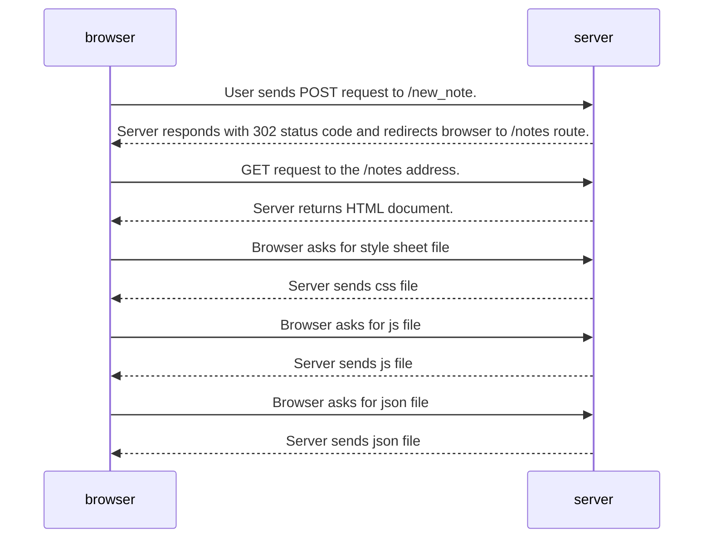

```mermaid
sequenceDiagram
    participant browser
    participant server

    browser->>server: User sends POST request to /new_note.
    server-->>browser: Server responds with 302 status code and redirects browser to /notes route.

    browser->>server: GET request to the /notes address.
    server-->>browser: Server returns HTML document.

    browser->>server: Browser asks for style sheet file
    server-->>browser: Server sends css file

    browser->>server: Browser asks for js file
    server-->>browser: Server sends js file

    browser->>server: Browser asks for json file
    server-->>browser: Server sends json file
```