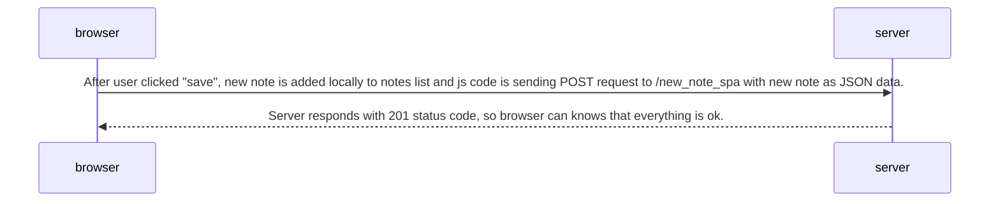

```mermaid
sequenceDiagram
    participant browser
    participant server

    browser->>server: After user clicked "save", new note is added locally to notes list and js code is sending POST request to /new_note_spa with new note as JSON data.
    server-->>browser: Server responds with 201 status code, so browser can knows that everything is ok.
```